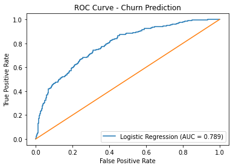

# 📊 Customer Churn Prediction & Retention Strategy

**Tools Used:** PostgreSQL | Python (Pandas, Scikit-learn) | Power BI  
**Techniques:** Logistic Regression | ROC-AUC | Threshold Tuning | Feature Importance  
**Domain:** SaaS / Subscription Analytics

Executive Summary

Customer churn represents a significant revenue risk for subscription-based businesses. In this project, I conducted an end-to-end churn analysis using SQL, Python, and Power BI to identify churn drivers, quantify financial impact, and build a predictive model to proactively detect at-risk customers.

The analysis revealed a 26.54% churn rate, resulting in approximately $7.7M in lost customer lifetime value (CLTV). A logistic regression model achieved an AUC score of 0.789, demonstrating strong predictive capability. By adjusting the classification threshold, churn detection recall improved from 47% to 61%, enabling earlier intervention strategies.

# 📸 Project Visuals

## ROC Curve

## Feature Importance

## Power BI Dashboard

Business Problem

A SaaS company is experiencing increasing customer churn but lacks clarity on:

Which customers are most likely to churn

What factors drive churn behavior

The financial impact of churn

How to proactively reduce customer attrition

Churn directly affects revenue, profitability, and customer lifetime value. Leadership requires both descriptive and predictive insights to support retention strategies.

Methodology
1️⃣ SQL — Descriptive & Financial Analysis

Calculated overall churn rate (26.54%)

Analyzed churn by contract type

Quantified monthly revenue and CLTV lost due to churn

Identified top customer-reported churn reasons

Key SQL Findings:

Month-to-month contracts have a 42.71% churn rate

Two-year contracts reduce churn to 2.83%

$139K in monthly revenue lost

$7.75M in lifetime value lost

2️⃣ Python — Predictive Modeling
Data Preparation

Cleaned and standardized column names

Removed data leakage variables (churn_score, churn_reason)

Encoded categorical variables using one-hot encoding

Train-test split (80/20)

Model

Logistic Regression

ROC-AUC Evaluation

Threshold tuning (0.50 → 0.35)

Model Performance

Accuracy: 78%

ROC-AUC: 0.789

Churn Recall (Default 0.50 threshold): 47%

Churn Recall (Adjusted 0.35 threshold): 61%

Lowering the threshold increased detection of at-risk customers while accepting higher false positives — a strategic trade-off in retention analytics.

3️⃣ Feature Importance Insights
Top Drivers Increasing Churn Risk:

Higher Monthly Charges

Fiber Optic Internet Service

Electronic Check Payment Method

Paperless Billing

Senior Citizen Status

Top Drivers Reducing Churn Risk:

Longer Tenure

Two-Year Contracts

Customers with Dependents

The model findings aligned with SQL insights, strengthening the credibility of the analysis.

Skills Demonstrated
SQL

Aggregations

Window Functions

Business KPI Calculations

Revenue Impact Analysis

Python

Pandas (Data Cleaning & Transformation)

Scikit-learn (Logistic Regression)

Model Evaluation (Confusion Matrix, ROC Curve)

Feature Importance Interpretation

Power BI

KPI Dashboard Design

Churn Trend Visualization

Contract & Revenue Segmentation

Executive-Level Reporting

Results & Business Recommendations
📊 Key Results

1 in 4 customers churn (26.54%)

Month-to-month contracts drive churn

High monthly charges increase churn probability

Longer tenure significantly reduces churn

Predictive model identifies 61% of churners proactively

💡 Business Recommendations

Promote long-term contracts through discounts or loyalty programs.

Offer early retention incentives within first 12 months.

Review pricing strategy for high monthly charge segments.

Improve customer support experience.

Target fiber optic customers with retention campaigns.

By applying predictive risk scoring, the company can proactively intervene and potentially recover significant lifetime value.

Next Steps

Deploy model as a Flask API for real-time churn scoring

Implement automated retention alerts

Integrate with CRM system

Conduct A/B testing on retention offers

Explore advanced models (Random Forest, XGBoost)

# 📈 Business Impact

If deployed in production, this predictive system could help proactively target high-risk customers and potentially recover a portion of the $7.7M in at-risk lifetime value through strategic retention campaigns.